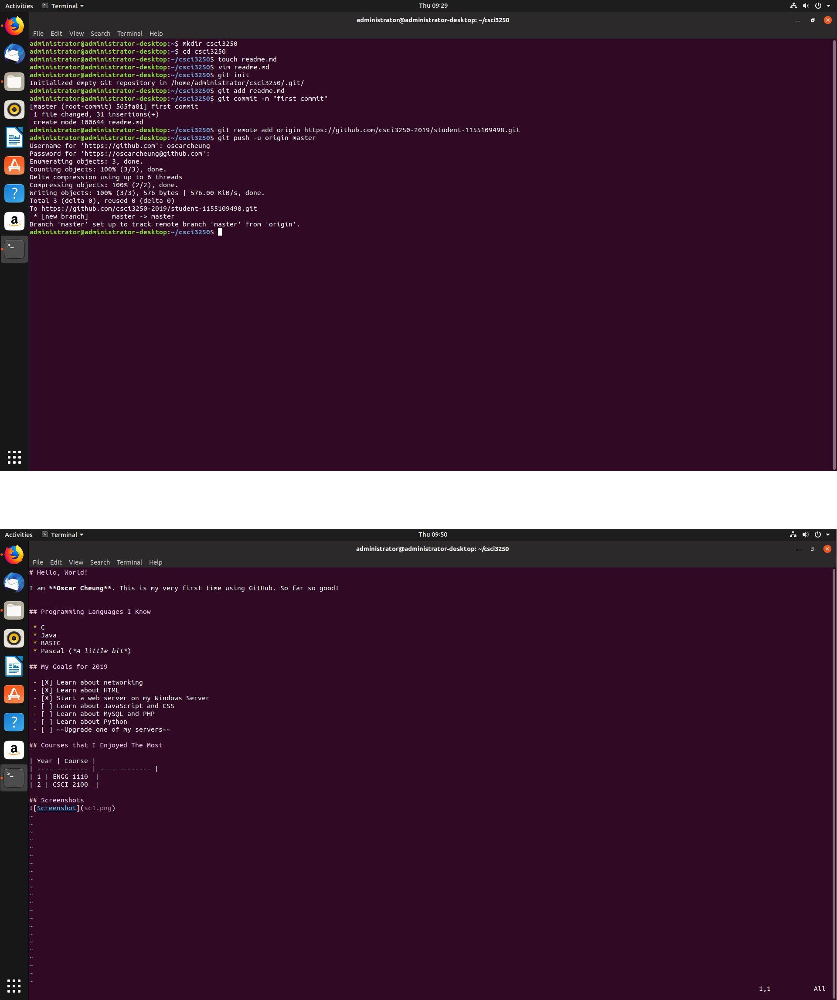

# Hello, World!

I am **Oscar Cheung**. This is my very first time using GitHub. So far so good!

## Programming Languages I Know

 * C
 * Java
 * BASIC
 * Pascal (*A little bit*)
 
## My Goals for 2019 

 - [X] Learn about networking
 - [X] Learn about HTML
 - [X] Start a web server on my Windows Server
 - [ ] Learn about JavaScript and CSS
 - [ ] Learn about MySQL and PHP
 - [ ] Learn about Python
 - [ ] ~~Upgrade one of my servers~~

## Courses that I Enjoyed The Most

| Year | Course |
| ------------- | ------------- |
| 1 | ENGG 1110  |
| 2 | CSCI 2100  |

## Screenshots
